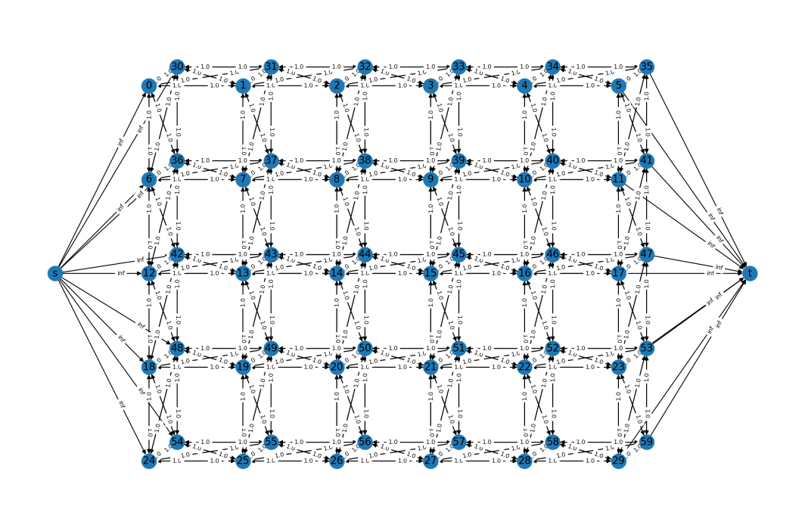
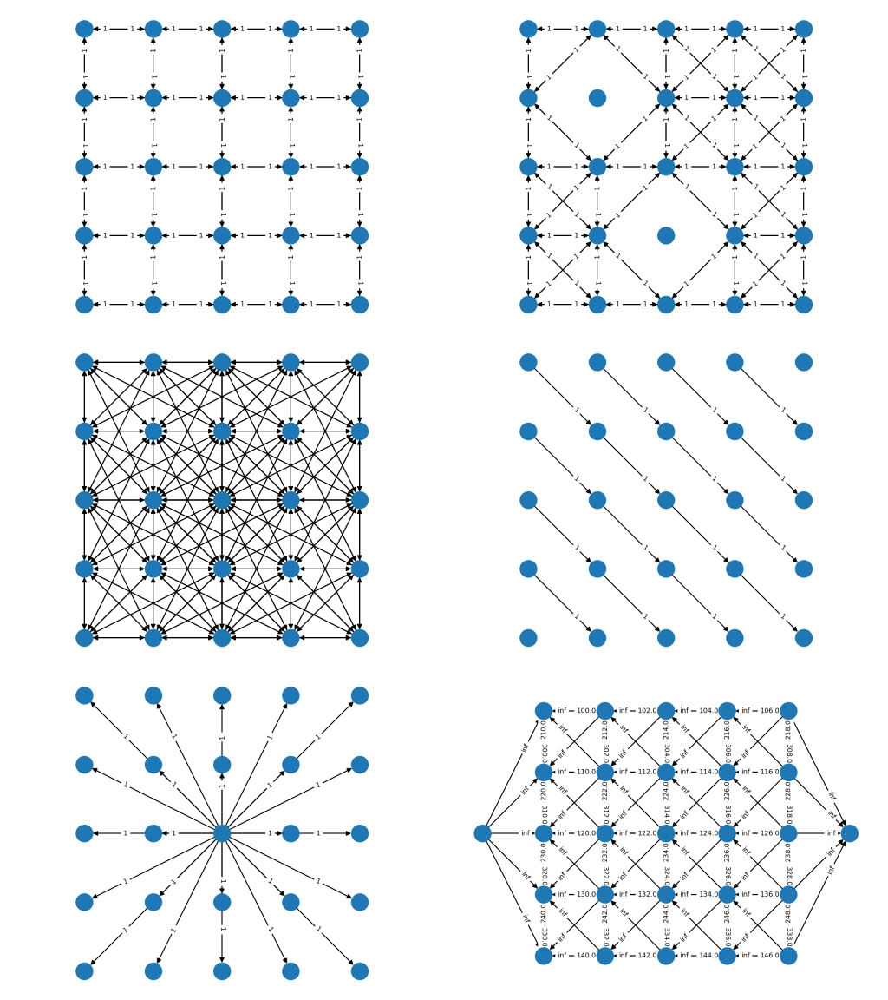

PyMaxflow
---------
PyMaxflow is a Python library for graph construction and maxflow computation
(commonly known as `graph cuts`).

The core of this library is the C++ implementation by Vladimir Kolmogorov,
which can be downloaded from his `homepage <http://pub.ist.ac.at/~vnk/software.html>`_.
Besides the wrapper to the C++ library, PyMaxflow offers

* NumPy integration,
* methods for fast construction of common graph
  layouts in computer vision and graphics,
* implementation of algorithms for fast energy
  minimization which use the ``maxflow`` method: the αβ-swap
  and the α-expansion.

Take a look at the `PyMaxflow documentation <http://pmneila.github.io/PyMaxflow/>`_.

Example layouts
---------------

PyMaxflow offers methods to easily build advanced network layouts with a few API
calls. These are examples from `layout_examples.py <https://github.com/pmneila/PyMaxflow/tree/master/examples/layout_examples.py>`_.

Installation
------------

Open a terminal and write::

  $ pip install PyMaxflow

Manual installation
-------------------

Download the source code or clone the Github repository. Open a terminal and
write::

  $ cd path/to/PyMaxflow
  $ python setup.py build
  ... lots of text ...

If everything went fine, you should be able to install the package with::

  $ python setup.py install
