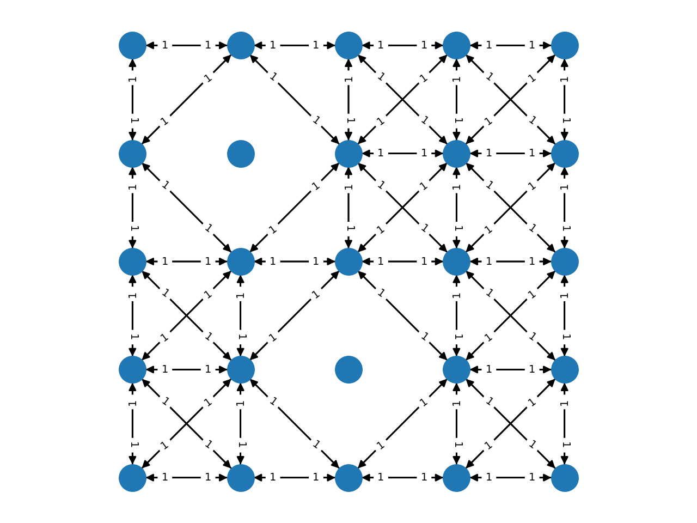

*PyMaxflow* is a Python library to build flow networks and compute their maximum
flow/minimum cut (commonly known as `graph cuts`) as described in [BOYKOV04]_.
This is a common technique used in different problems of image processing,
computer vision and computer graphics. The core of this library is the C++
maxflow implementation by Vladimir Kolmogorov, which can be downloaded from his
`homepage <http://pub.ist.ac.at/~vnk/software.html>`_. Besides being a wrapper
to the C++ library, PyMaxflow also offers

* NumPy integration,
* methods for fast declaration of complex network layouts with a single API
  call, which avoids the much slower one-call-per-edge alternative offered by
  the wrapped functions of the core C++ library, and
* implementation of algorithms for fast energy minimization with more than two
  labels: the αβ-swap and the α-expansion.

Check the `PyMaxflow documentation <http://pmneila.github.io/PyMaxflow/>`_.

Example layouts
---------------

PyMaxflow offers methods to easily build advanced network layouts with a few API
calls:

.. image:: doc/source/_static/layout_01.png
   :scale: 25 %

.. image:: doc/source/_static/layout_04.png
   :scale: 25 %

.. image:: doc/source/_static/layout_07.png
   :scale: 25 %

Check the `examples <https://github.com/pmneila/PyMaxflow/tree/master/examples>`_ for details.

Installation
------------

Open a terminal and write::

  $ pip install PyMaxflow

Manual installation
-------------------

Download the source code or clone the Github repository. Open a terminal and
write::

  $ cd path/to/PyMaxflow
  $ python setup.py build
  ... lots of text ...

If everything went fine, you should be able to install the package with::

  $ python setup.py install
