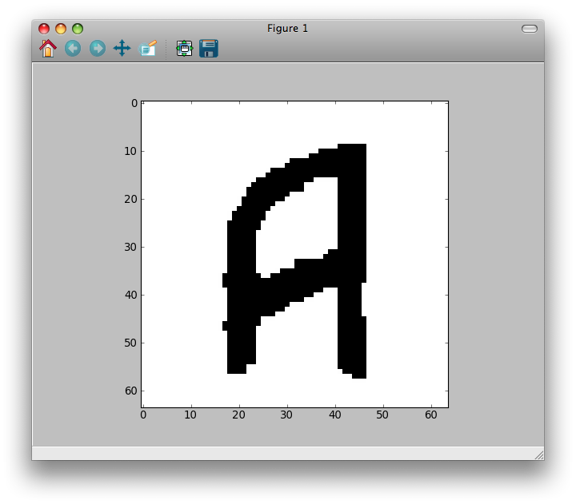

.. _tutorial:

Tutorial
========

.. The *maximum flow* (maxflow) problem is a common concept
   in optimization and graph theory. Given a directed graph
   where each edge has a capacity, the maximum flow
   problem consists on
   finding a feasible flow between a single source node and
   a single sink node that is maximum.

This tutorial is
aimed to those who know the maximum flow problem
and its applications to computer vision and graphics.
It explains how to use the *PyMaxflow* library
in some key problems, but it assumes that the reader
knows the theoretical background of graph-cuts.

Getting started
---------------

Once you have installed the PyMaxflow library, you can
import it as usual::

  import maxflow
  print maxflow.__version__

A first example
---------------

The first example consists on constructing and finding the maximum
flow of a custom graph:

.. image:: _static/graph.png
   :scale: 50 %

This graph has two *terminal* nodes, the source :math:`s` and the sink :math:`t`,
and two *non-terminal* nodes, labeled 0 and 1. The code for building
this graph is::

  import maxflow
  
  # Create a graph with integer capacities.
  g = maxflow.Graph[int](2, 2)
  # Add two (non-terminal) nodes. Get the index to the first one.
  nodes = g.add_nodes(2)
  # Create two edges (forwards and backwards) with the given capacities.
  # The indices of the nodes are always consecutive.
  g.add_edge(nodes[0], nodes[1], 1, 2)
  # Set the capacities of the terminal edges...
  # ...for the first node.
  g.add_tedge(nodes[0], 2, 5)
  # ...for the second node.
  g.add_tedge(nodes[1], 9, 4)

Pretty straightforward, but some details worth mentioning.
First, the data type of the capacities can be *integer*,
as in the example, or *float*. In that case, the
graph construction would be::

  g = maxflow.Graph[float](2, 2)

Second, the constructor parameters are an initial
estimation of the number of nodes and the number
of non-terminal edges. These estimations do not need
to be perfect, not even approximate. But a better
estimation will lead to a better performance in terms
of memory usage. Please, consult the
documentation of the constructor for more details.
In this example, we exactly know how many nodes
and non-terminal edges the graph has when
we call the constructor.

Third, you do *not* have to create the terminal nodes.
Every graph have
implicitly defined both nodes. Moreover, you cannot create more
terminal nodes. The non-terminal edges (those connecting
two non-terminal nodes) are created with ``add_edge``. The
terminal edges (those connecting a non-terminal node to a
terminal node) are created with ``add_tedge``.

Now we can find the maximum flow in the graph::

  flow = g.maxflow()
  print "Maximum flow:", flow

Finally, we want to know the shape of the partition
given by the minimum cut::

  print "Segment of the node 0:", g.get_segment(nodes[0])
  print "Segment of the node 1:", g.get_segment(nodes[1])

The method ``get_segment`` returns ``1`` when the
given node belongs to the partition of the source node (i.e., the
minimum cut severs the terminal edge from the node to the sink),
or ``0`` otherwise (i.e., the minimum cut severs
the terminal edge from the source to the node).

This example is available in :file:`examples/simple.py`. If you
run this code, it will print::

  Maximum flow: 8
  Segment of the node 0: 1
  Segment of the node 1: 0

This means that the minimum cut severs the graph in this way:

.. image:: _static/graph2.png
   :scale: 50 %

The severed edges are marked with dashed lines. Indeed, the sum
of the capacities of these edges is equal to the maximum flow 8.

Binary image restoration
------------------------

In this example we will learn to build 4-connected grid layouts with
a few calls. This kind of layouts is very common is tasks such as
binary image restoration. We take the binary image

.. image:: _static/a.png

and add strong gaussian noise to it:

.. image:: _static/a2.png

You can download this image from this page using the right-click menu
of your browser. You can load it into Python with::

  import numpy as np
  import scipy
  from scipy.misc import imread
  import maxflow
  
  img = imread("a2.png")

We will restore the image minimizing the energy

.. math::
   E(\mathbf{x}) = \sum_i D_i(x_i) + \sum_{(i,j)\in\mathcal{C}} K|x_i - x_j|.

:math:`\mathbf{x} \in \{0,1\}^N` are the values of the restored image, :math:`N`
is the number of pixels. The unary term :math:`D_i(0)` (resp :math:`D_i(1)`)
is the penalty for assigning the value 0 (resp 1) to the i-th pixel. Each
:math:`D_i` depends on the values of the noisy image, which are denoted as
:math:`p_i`:

.. math::
   D_i(x_i) = \begin{cases} p_i & \textrm{if } x_i=0\\ 255-p_i & \textrm{if } x_i=1 \end{cases}.

Thus, :math:`D_i` is low when assigning the label 0 to dark pixels or the
label 1 to bright pixels, and high otherwise.
The value :math:`K` is the regularization strength. The larger :math:`K`
the smoother the restoration. We fix it to 50.

The maximum flow algorithm is widely used to minimize energy functions of this
type. We build a graph which represents the above energy. This graph has as many
non-terminal nodes as pixels in the image. The nodes are connected in a grid
arrangement, so that the nodes corresponding to neighbor pixels are connected
by a forward and a backward edge. The capacities of all non-terminal edges
is :math:`K`. The capacities of the edges from the source node are set
to :math:`D_i(0)`, and the capacities of the edges to the sink node are :math:`D_i(1)`.

We could build this graph as in the first example. First, we would add all the nodes.
Then, we would iterate over the nodes adding the edges properly. However, this is extremely
slow in Python, especially when dealing with large images or stacks of images.
*PyMaxflow* provides methods for building some complex graphs with a few calls.
In this example we review ``add_grid_nodes``, ``add_grid_edges``,
which add edges with a fixed capacity to the grid,
and ``add_grid_tedges``, which sets
the capacities of the terminal edges for multiple nodes::

  # Create the graph.
  g = maxflow.Graph[int]()
  # Add the nodes. nodeids has the identifiers of the nodes in the grid.
  nodeids = g.add_grid_nodes(img.shape)
  # Add non-terminal edges with the same capacity.
  g.add_grid_edges(nodeids, 50)
  # Add the terminal edges. The image pixels are the capacities
  # of the edges from the source node. The inverted image pixels
  # are the capacities of the edges to the sink node.
  g.add_grid_tedges(nodeids, img, 255-img)

Finally, we perform the maxflow computation and get the results::

  # Find the maximum flow.
  g.maxflow()
  # Get the segments of the nodes in the grid.
  sgm = g.get_grid_segments(nodeids)

The method ``get_grid_segments`` returns an array with
the same shape than ``nodeids``. It is almost equivalent to calling
``get_segment`` once for each node in ``nodeids``, but much faster.
For the i-th cell, the array stores ``False``
if the i-th node belongs to the source segment (i.e., the
corresponding pixel has the label 1) and ``True`` if the
node belongs to the sink segment (i.e., the corresponding
pixel has the label 0). We now get the labels for each pixel::

  # The labels should be 1 where sgm is False and 0 otherwise.
  img2 = np.int_(np.logical_not(sgm))
  # Show the result.
  from matplotlib import pyplot as ppl
  ppl.imshow(img2)
  ppl.show()

The result is:

This is a comparison between the original image (left), the noisy one (center)
and the restoration of this example (right):

.. image:: _static/comparison.png
   :scale: 50 %

Complex grids with ``add_grid_edges``
-------------------------------------

 .. note:: This section is a draft. It has to be improved and extended with
           more examples and figures.

The method ``add_grid_edges`` is a powerful tool to create complex layouts. The
first argument, ``nodeids`` is an array of node identifiers with the shape of
the grid of nodes where the edges will be added. The edges to add and their
final capacities are computed using the arguments ``weights`` and ``structure``.

``weights`` is an array and its shape must be broadcastable to the shape of
``nodeids``. Thus every node will have a associated weight. ``structure`` is
an array with the same dimensions as ``nodeids`` and with an odd shape. It
defines the local neighborhood of every node.

Given a node, the ``structure`` array is centered on it. Edges are created
from that node to the nodes of its neighborhood corresponding to nonzero entries
of ``structure``. The capacity of the new edge will be the product of the
weight of the initial node and the corresponding value in ``structure``.
Additionally, a reverse edge with the same capacity will be added if
the argument ``symmetric`` is ``True`` (by default).

Therefore, the ``weights`` argument allows to define an inhomogeneous graph,
with different capacities in different areas of the grid. On the other hand,
besides defining the local neighborhood of each node, ``structure`` enables
anisotropic edges, with different capacities depending on their orientation.

The file :file:`examples/layout_examples.py` and the documentation of
:py:meth:`maxflow.GraphInt.add_grid_edges` contain several different layouts
than can be created with ``add_grid_edges``. A more involved example is in
:file:`examples/layout_example2.py`, where a complex graph is created using
several calls to :py:meth:`maxflow.GraphInt.add_grid_edges` and
:py:meth:`maxflow.GraphInt.add_grid_tedges`.

.. [BOYKOV06] *Graph Cuts in Vision and Graphics: Theories and Applications*.
   Yuri Boykov, Olga Veksler.
